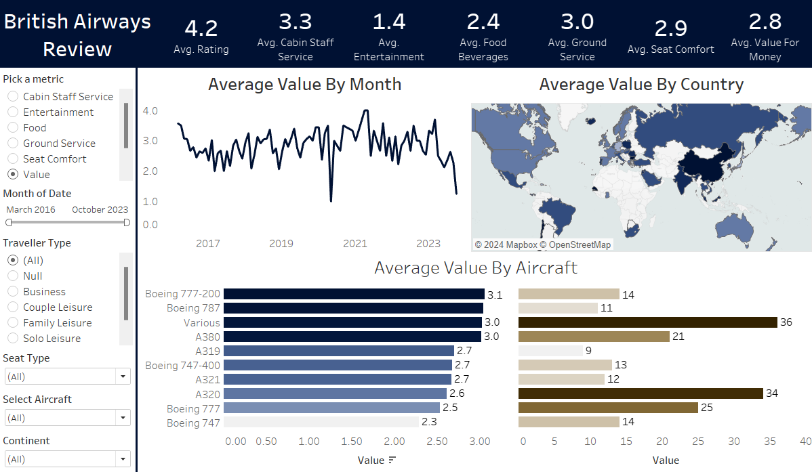

# British Airways Review Analysis

This repository contains an analysis of customer reviews for British Airways. The project aims to uncover insights into customer satisfaction, highlight key trends, and provide actionable recommendations for improving services.

---

## Overview

The **British Airways Review Analysis** explores customer feedback to:
- Identify factors influencing customer satisfaction.
- Highlight frequently mentioned concerns or issues.
- Analyze regional trends and sentiment across different countries.

---

## Files in Repository

- **`ba_reviews.csv`**: Contains customer reviews with fields like feedback text, ratings, and dates.
- **`Countries.csv`**: A dataset mapping country codes to their respective country names for regional analysis.
- **`British Airways Review Analysis.twbx`**: Tableau workbook containing interactive visualizations of the analysis.
- **`README.md`**: This documentation file.

---

## Dashboard Features

The **Tableau Dashboard** provides insights into:
- **Sentiment Analysis**: Evaluates positive and negative trends in customer feedback.
- **Key Metrics**:
  - Average Rating
  - Commonly Mentioned Complaints
  - Trends over Time
- **Regional Analysis**: Visualizes trends across different countries and regions.
- **Top Factors**: Highlights the aspects customers frequently discuss (e.g., service quality, in-flight experience).

---

## Dataset Description

1. **`ba_reviews.csv`**:
   - **Review Text**: Customer feedback as free text.
   - **Rating**: Customer satisfaction score.
   - **Date**: The date of the review.
   - **Additional Fields**: Other details for deeper analysis.

2. **`Countries.csv`**:
   - **Country Code**: Two-letter ISO country code.
   - **Country Name**: Full name of the country.

---

## Key Insights

1. **Positive Feedback**:
   - Customers praised in-flight entertainment, food quality, and cabin cleanliness.
2. **Negative Feedback**:
   - Delays, poor customer service, and lost luggage were frequently mentioned concerns.
3. **Regional Trends**:
   - European customers rated the airline higher compared to North America and Asia.
4. **Seasonal Trends**:
   - Complaints about delays spiked during the holiday season.
5. **Rating Patterns**:
   - Ratings are polarized, with most reviews clustered around `4 stars` (positive) and `2 stars` (negative).

---

## Future Enhancements

- **Sentiment Analysis**:
  - Apply natural language processing (NLP) techniques to better understand customer emotions.
- **Integration with Social Media Data**:
  - Expand the analysis to include Twitter and Instagram mentions for real-time feedback.
- **Predictive Analysis**:
  - Use machine learning to predict future customer satisfaction trends based on past reviews.
- **Interactive Dashboard Improvements**:
  - Add filters for more granular analysis, such as by year, specific routes, or customer demographics.

---

## Contact

For further questions or feedback, feel free to reach out:

**Altamash Rahman**  
**[LinkedIn]([www.linkedin.com/in/altamash-ra](https://www.linkedin.com/in/altamash-rahman-b399b1178/))**  
**Email: altamash6044@gmail.com**
